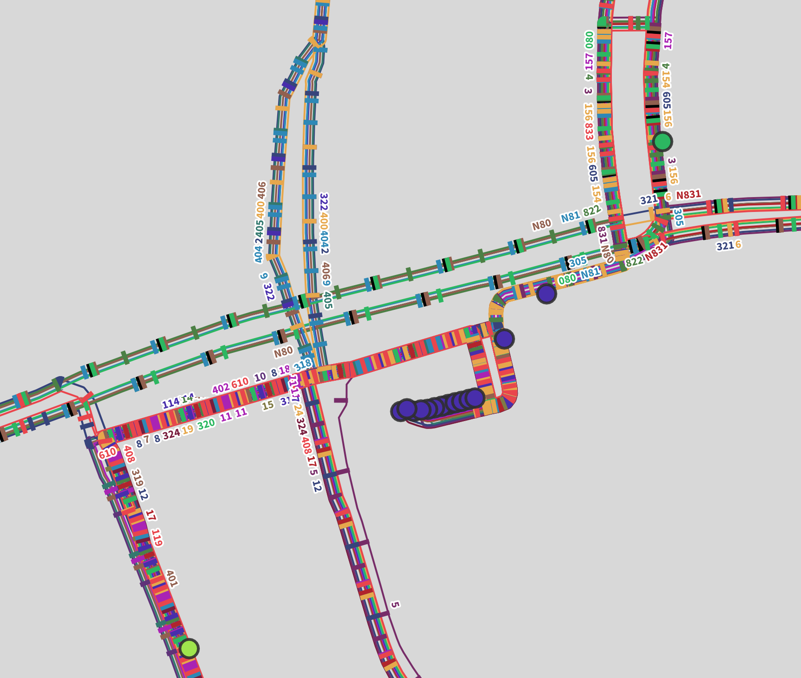

# Tracestrack Bus Route Map Layer

This is Carto map style for bus routes layer provided in Tracestrack Map
Service. The goal is to provide an informative maps focusing on bus routes and
stops.

Example use cases:
1. find which buses stop at a certain bus stop.
2. relatively easy to trace certain bus lines.

## Screenshots

## How to build

Please follow the guideline in
[gravitystorm/openstreetmap-carto](https://github.com/gravitystorm/openstreetmap-carto/blob/master/INSTALL.md),
to have a basic openstreetmap render setup.

You will need to update postgres connection credentials in `project_bus_route.mml`.
